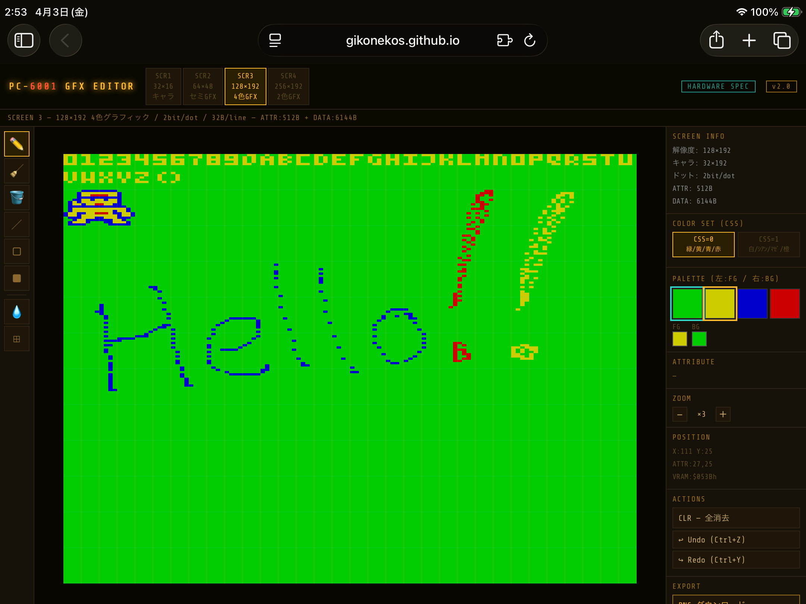

# PC-6001 GFX Editor

**Browser-based pixel art editor for the NEC PC-6001 home computer.**  
No install, no dependencies — open the HTML file and start drawing.

---

## v2.0 — Hardware Spec Edition

> Compliant with actual PC-6001 VRAM specification.  
> SCREEN 1–4, attribute structure, CSS color sets — all based on real hardware.  
> VRAM spec reference: https://000.la.coocan.jp/p6/tech.html#vram

🎨 **[Open Editor v2](https://gikonekos.github.io/pc6001-gfx-editor/pc6001-gfx-editor2.html)** &nbsp;|&nbsp; 📖 **[Manual v2](https://gikonekos.github.io/pc6001-gfx-editor/pc6001-gfx-editor2-manual.html)**

### Screenshot



### Features (v2.0)

- **4 Screen Modes (hardware spec)** — SCREEN 1 (32×16 chars), SCREEN 2 (64×48 semi-gfx), SCREEN 3 (128×192 4-color), SCREEN 4 (256×192 2-color)
- **Real VRAM structure** — 512B attribute + data area, matching actual PC-6001 VRAM layout
- **CSS color sets** — CSS=0/1 switchable per mode, faithful to hardware color definitions
- **2bit/dot (SCR3) / 1bit/dot (SCR4)** — correct bit-level data structure, 32B/line, MSB=left
- **Hardware-spec ASM output** — ATTR block (512B) + DATA block in real VRAM format
- **8 Drawing tools** — Pen, Eraser, Flood Fill, Line, Rectangle (outline/filled), Eyedropper, Attribute Select
- **.p6g save / load (version:2)** — saves attr[], data[], mode, css; incompatible with v1 .p6g files
- **PNG export** — display image export *(not an edit state save)*
- **Image import** — PNG/JPEG etc. (SCREEN 3/4 only in v2.0)
- **Undo / Redo** — 50 steps
- **Zoom** — ×1 to ×8
- **Keyboard shortcuts** — P / E / F / L / R / I / C / Ctrl+Z / Ctrl+Y
- **Single HTML file** — zero dependencies, works fully offline

> **Note:** Full SCREEN 1/2 character/semi-graphic editing is planned for v2.1+.  
> All exported files are saved to your browser's default download folder (browser security restriction).

### Files (v2.0)

| File | Description |
|------|-------------|
| `pc6001-gfx-editor2.html` | Editor v2 application |
| `pc6001-gfx-editor2-manual.html` | v2 Specification & user manual (EN/JP) |

---

## v1 Series — April Fools' Edition

> **Note:** v1 uses a custom (non-hardware) implementation — independent screen numbering, custom 16-color palette, and custom data structure not based on real PC-6001 VRAM specs.  
> Released on April 1, 2026 as an April Fools' project. Lightweight, simple, and functional.

🎨 **[Open Editor v1](https://gikonekos.github.io/pc6001-gfx-editor/pc6001-gfx-editor.html)** &nbsp;|&nbsp; 📖 **[Manual v1](https://gikonekos.github.io/pc6001-gfx-editor/pc6001-gfx-editor-manual.html)**

### Screenshot


### Features (v1 series)

- **3 Custom Screen Modes** — SCR1 (128×192, custom 16-color), SCR2 (128×192, 2 colors/row), SCR3 (64×192, custom 16-color)
- **Correct pixel aspect ratio** — matches PC-6001's actual 4:3 TV output (2:1 for SCR1/2, 4:1 for SCR3)
- **8 Drawing tools** — Pen, Eraser, Flood Fill, Line, Rectangle (outline/filled), Eyedropper, Character Select
- **Per-character color editing** — 8×8 character grid editor for SCR1/3
- **Custom 16-color palette**
- **.p6g save / load (version:1)** — saves complete edit state; incompatible with v2 .p6g files
- **PNG export** — native resolution output *(display image only, not an edit state save)*
- **Z80 ASM export** — `DB` byte format, pattern data + color data separated
- **Image import** — accepts PNG, JPEG and other browser-supported formats
- **Undo / Redo** — 50 steps
- **Zoom** — ×1 to ×8
- **Keyboard shortcuts** — P / E / F / L / R / I / C / Ctrl+Z / Ctrl+Y
- **Single HTML file** — zero dependencies, works fully offline

> **Note:** All exported files are saved to your browser's default download folder (browser security restriction).

### Files (v1 series)

| File | Description |
|------|-------------|
| `pc6001-gfx-editor.html` | Editor v1 application |
| `pc6001-gfx-editor-manual.html` | v1 Specification & user manual (EN/JP) |

---

## Usage

```
git clone https://github.com/gikonekos/pc6001-gfx-editor.git
```

Open the HTML file directly in any modern browser. No server required.

| Version | URL |
|---------|-----|
| v2.0 Editor | `https://gikonekos.github.io/pc6001-gfx-editor/pc6001-gfx-editor2.html` |
| v2.0 Manual | `https://gikonekos.github.io/pc6001-gfx-editor/pc6001-gfx-editor2-manual.html` |
| v1 Editor | `https://gikonekos.github.io/pc6001-gfx-editor/pc6001-gfx-editor.html` |
| v1 Manual | `https://gikonekos.github.io/pc6001-gfx-editor/pc6001-gfx-editor-manual.html` |

---

## Changelog

| Version | Date | Changes |
|---------|------|---------|
| v2.0 | 2026-04-03 | Hardware spec compliant edition. Real SCREEN 1–4, VRAM attribute structure, CSS color sets, correct bit layout. New standalone HTML, separate from v1 series. |
| v1.6 | 2026-04-01 | Add .p6g edit state save/load; clarify PNG export meaning; rename image import button; expand accepted image formats |
| v1.5 | 2026-04-01 | Fix single-color block detection — `second <= 0` was wrong; corrected to `second === -1` |
| v1.4 | 2026-04-01 | Fix single-color block — FG=BG case now forces BG to black/white for contrast |
| v1.3 | 2026-04-01 | PNG/JPEG import overhaul — per-character top-2 color auto-detection for FG/BG; fixed solid-color rendering bug |
| v1.2 | 2026-04-01 | Fix PNG import bug — palette index was collapsed to 0/1, causing all pixels to render as FG color |
| v1.1 | 2026-04-01 | Correct pixel aspect ratio (2:1 for SCR1/2, 4:1 for SCR3) |
| v1.0 | 2026-04-01 | Initial release |

---

## License

MIT License — see [LICENSE](LICENSE) for details.

---
---

# PC-6001 GFX エディタ

**NEC PC-6001 用ブラウザベースのピクセルアートエディタ。**  
インストール不要・外部依存なし。HTML ファイルを開くだけで動作します。

---

## v2.0 — 実機ハードウェア仕様準拠版

> PC-6001 の実機 VRAM 仕様に準拠した再設計版。  
> SCREEN 1〜4・アトリビュート構造・CSS 色セットをすべて実機仕様に基づいて実装。  
> VRAM 仕様参照元: https://000.la.coocan.jp/p6/tech.html#vram

🎨 **[エディタ v2 を開く](https://gikonekos.github.io/pc6001-gfx-editor/pc6001-gfx-editor2.html)** &nbsp;|&nbsp; 📖 **[マニュアル v2](https://gikonekos.github.io/pc6001-gfx-editor/pc6001-gfx-editor2-manual.html)**

### 機能一覧 (v2.0)

- **4 スクリーンモード（実機仕様）** — SCREEN 1（32×16キャラ）/ SCREEN 2（64×48セミGFX）/ SCREEN 3（128×192 4色）/ SCREEN 4（256×192 2色）
- **実機 VRAM 構造** — アトリビュート 512B + データ領域（実機 VRAM レイアウトに準拠）
- **CSS 色セット** — CSS=0/1 切り替え、各モードの実機色定義に忠実
- **2bit/dot (SCR3) / 1bit/dot (SCR4)** — 正確なビットレベルデータ構造、32B/ライン、MSB=左端
- **実機VRAM形式 ASM 出力** — ATTR ブロック（512B）+ DATA ブロック、実機書き込み可能な形式
- **8 種類の描画ツール** — ペン・消しゴム・塗りつぶし・直線・矩形（枠/塗り）・スポイト・アトリビュート選択
- **.p6g 保存/読込（version:2）** — attr[]・data[]・mode・css をすべて保持。v1系 .p6g とは非互換
- **PNG エクスポート** — 表示画像の書き出し（編集状態の保存ではありません）
- **画像読み込み** — PNG/JPEG 等（v2.0 は SCREEN 3/4 のみ対応）
- **Undo / Redo** — 50 段
- **ズーム** — ×1〜×8
- **キーボードショートカット** — P / E / F / L / R / I / C / Ctrl+Z / Ctrl+Y
- **シングルファイル HTML** — 外部依存なし、完全オフライン動作

> **注意:** SCREEN 1/2 のキャラクタ・セミグラフィック完全編集は v2.1 以降で対応予定。  
> 出力ファイルはすべてブラウザの既定ダウンロードフォルダに保存されます（保存先選択不可）。

### ファイル構成 (v2.0)

| ファイル | 内容 |
|----------|------|
| `pc6001-gfx-editor2.html` | エディタ v2 本体 |
| `pc6001-gfx-editor2-manual.html` | v2 仕様書・利用マニュアル（日英） |

---

## v1系 — エイプリルフール版

> **注意:** v1系は実機仕様とは異なる独自実装です。スクリーン番号・パレット・データ構造はすべて独自定義であり、実機 PC-6001 の VRAM 仕様に基づいていません。  
> 2026年4月1日のエイプリルフール企画としてリリース。軽量・シンプル・すぐ動く。

🎨 **[エディタ v1 を開く](https://gikonekos.github.io/pc6001-gfx-editor/pc6001-gfx-editor.html)** &nbsp;|&nbsp; 📖 **[マニュアル v1](https://gikonekos.github.io/pc6001-gfx-editor/pc6001-gfx-editor-manual.html)**

### 機能一覧 (v1系)

- **3 スクリーンモード（独自仕様）** — SCR1（128×192, 独自16色）/ SCR2（128×192, 2色/行）/ SCR3（64×192, 独自16色）
- **実アスペクト比対応** — 4:3 TV 出力に合わせたドット描画（SCR1/2 は 2:1、SCR3 は 4:1）
- **8 種類の描画ツール** — ペン・消しゴム・塗りつぶし・直線・矩形（枠/塗り）・スポイト・キャラ選択
- **キャラクタ単位の色編集** — SCR1/3 用 8×8 ビットグリッドエディタ
- **独自 16 色パレット**
- **.p6g 保存/読込（version:1）** — 編集状態の完全保存。v2系 .p6g とは非互換
- **PNG エクスポート** — 実寸サイズ出力（表示画像のみ、編集状態の保存ではありません）
- **Z80 ASM エクスポート** — `DB` バイト形式、パターンデータ＋カラーデータ分離出力
- **画像読み込み** — PNG/JPEG など、ブラウザ対応形式を広く受け付け
- **Undo / Redo** — 50 段
- **ズーム** — ×1〜×8
- **キーボードショートカット** — P / E / F / L / R / I / C / Ctrl+Z / Ctrl+Y
- **シングルファイル HTML** — 外部依存なし、完全オフライン動作

> **注意:** 出力ファイルはすべてブラウザの既定ダウンロードフォルダに保存されます（保存先選択不可）。

### ファイル構成 (v1系)

| ファイル | 内容 |
|----------|------|
| `pc6001-gfx-editor.html` | エディタ v1 本体 |
| `pc6001-gfx-editor-manual.html` | v1 仕様書・利用マニュアル（日英） |

---

## 使い方

```
git clone https://github.com/gikonekos/pc6001-gfx-editor.git
```

HTML ファイルをモダンブラウザで直接開いてください。サーバー不要。

| バージョン | URL |
|-----------|-----|
| v2.0 エディタ | `https://gikonekos.github.io/pc6001-gfx-editor/pc6001-gfx-editor2.html` |
| v2.0 マニュアル | `https://gikonekos.github.io/pc6001-gfx-editor/pc6001-gfx-editor2-manual.html` |
| v1 エディタ | `https://gikonekos.github.io/pc6001-gfx-editor/pc6001-gfx-editor.html` |
| v1 マニュアル | `https://gikonekos.github.io/pc6001-gfx-editor/pc6001-gfx-editor-manual.html` |

---

## バージョン履歴

| バージョン | 日付 | 変更内容 |
|------------|------|----------|
| v2.0 | 2026-04-03 | 実機ハードウェア仕様準拠版。実機 SCREEN 1〜4・VRAM アトリビュート構造・CSS 色セット・正確なビット配置を実装。v1系とは独立した別 HTML として新規作成。 |
| v1.6 | 2026-04-01 | .p6g 編集状態保存/読込追加・PNG保存の意味を明示・画像読み込みボタン改名・対応形式拡張 |
| v1.5 | 2026-04-01 | 単色ブロック判定バグ修正 — `second <= 0` が誤り、`second === -1` に修正 |
| v1.4 | 2026-04-01 | 単色ブロック問題修正 — FG=BGになる場合にBGを黒/白に強制してコントラスト確保 |
| v1.3 | 2026-04-01 | PNG/JPEG読み込み大幅改善 — キャラ単位で上位2色を自動検出しFG/BG設定、緑一色バグ修正 |
| v1.2 | 2026-04-01 | PNG読み込みバグ修正 — パレット番号が0/1に潰れ全ピクセルがFG色になる問題を修正 |
| v1.1 | 2026-04-01 | 実アスペクト比対応（SCR1/2 は 2:1、SCR3 は 4:1） |
| v1.0 | 2026-04-01 | 初期リリース |

---

## ライセンス

MIT License — 詳細は [LICENSE](LICENSE) をご覧ください。
