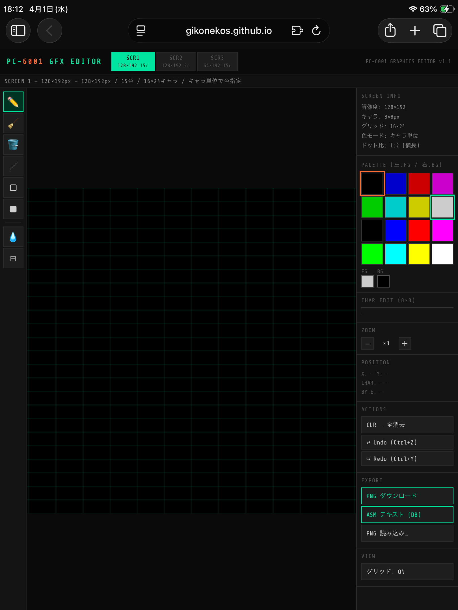

# PC-6001 GFX Editor

**Browser-based pixel art editor for the NEC PC-6001 home computer.**  
No install, no dependencies — open the HTML file and start drawing.

🎨 **[Open Editor](pc6001-gfx-editor.html)** &nbsp;|&nbsp; 📖 **[Manual](pc6001-gfx-editor-manual.html)**

---

## Screenshot

<!-- Add screenshot here -->


---

## Features

- **3 Screen Modes** — SCREEN 1 (128×192, 15 colors), SCREEN 2 (128×192, 2 colors/row), SCREEN 3 (64×192, 15 colors)
- **Correct pixel aspect ratio** — matches PC-6001's actual 4:3 TV output (2:1 for SCR1/2, 4:1 for SCR3)
- **8 Drawing tools** — Pen, Eraser, Flood Fill, Line, Rectangle (outline/filled), Eyedropper, Character Select
- **Per-character color editing** — 8×8 character grid editor for SCREEN 1/3
- **Fixed 16-color palette** — faithful to PC-6001 hardware
- **PNG export** — native resolution output
- **Z80 ASM export** — `DB` byte format, pattern data + color data separated
- **PNG import** — nearest-neighbor palette conversion
- **Undo / Redo** — 50 steps
- **Zoom** — ×1 to ×8
- **Keyboard shortcuts** — P / E / F / L / R / I / C / Ctrl+Z / Ctrl+Y
- **Single HTML file** — zero dependencies, works fully offline

---

## Usage

```
git clone https://github.com/gikonekos/pc6001-gfx-editor.git
```

Open `pc6001-gfx-editor.html` in any modern browser. No server required.

Or use **GitHub Pages** directly:  
`https://gikonekos.github.io/pc6001-gfx-editor/pc6001-gfx-editor.html`

---

## Files

| File | Description |
|------|-------------|
| `pc6001-gfx-editor.html` | Editor application |
| `pc6001-gfx-editor-manual.html` | Specification & user manual (EN/JP) |
| `README.md` | This file |

---

## Changelog

| Version | Date | Changes |
|---------|------|---------|
| v1.1 | 2026-04-01 | Correct pixel aspect ratio (2:1 for SCR1/2, 4:1 for SCR3) |
| v1.0 | 2026-04-01 | Initial release |

---

## License

MIT License — see [LICENSE](LICENSE) for details.

---

---

# PC-6001 GFX エディタ

**NEC PC-6001 用ブラウザベースのピクセルアートエディタ。**  
インストール不要・外部依存なし。HTML ファイルを開くだけで動作します。

🎨 **[エディタを開く](pc6001-gfx-editor.html)** &nbsp;|&nbsp; 📖 **[マニュアル](pc6001-gfx-editor-manual.html)**

---

## 機能一覧

- **3 スクリーンモード対応** — SCREEN 1 (128×192, 15色) / SCREEN 2 (128×192, 2色/行) / SCREEN 3 (64×192, 15色)
- **実アスペクト比対応** — PC-6001 の 4:3 TV 出力に合わせたドット描画（SCR1/2 は 2:1、SCR3 は 4:1）
- **8 種類の描画ツール** — ペン・消しゴム・塗りつぶし・直線・矩形（枠/塗り）・スポイト・キャラ選択
- **キャラクタ単位の色編集** — SCREEN 1/3 用 8×8 ビットグリッドエディタ
- **固定 16 色パレット** — PC-6001 ハードウェア準拠
- **PNG エクスポート** — 実寸サイズ出力
- **Z80 ASM エクスポート** — `DB` バイト形式、パターンデータ＋カラーデータ分離出力
- **PNG 読み込み** — 最近傍パレット変換
- **Undo / Redo** — 50 段
- **ズーム** — ×1〜×8
- **キーボードショートカット** — P / E / F / L / R / I / C / Ctrl+Z / Ctrl+Y
- **シングルファイル HTML** — 外部依存なし、完全オフライン動作

---

## 使い方

```
git clone https://github.com/gikonekos/pc6001-gfx-editor.git
```

`pc6001-gfx-editor.html` をモダンブラウザで開いてください。サーバー不要。

または **GitHub Pages** から直接：  
`https://gikonekos.github.io/pc6001-gfx-editor/pc6001-gfx-editor.html`

---

## ファイル構成

| ファイル | 内容 |
|----------|------|
| `pc6001-gfx-editor.html` | エディタ本体 |
| `pc6001-gfx-editor-manual.html` | 仕様書・利用マニュアル（日英） |
| `README.md` | このファイル |

---

## バージョン履歴

| バージョン | 日付 | 変更内容 |
|------------|------|----------|
| v1.1 | 2026-04-01 | 実アスペクト比対応（SCR1/2 は 2:1、SCR3 は 4:1） |
| v1.0 | 2026-04-01 | 初期リリース |

---

## ライセンス

MIT License — 詳細は [LICENSE](LICENSE) をご覧ください。
